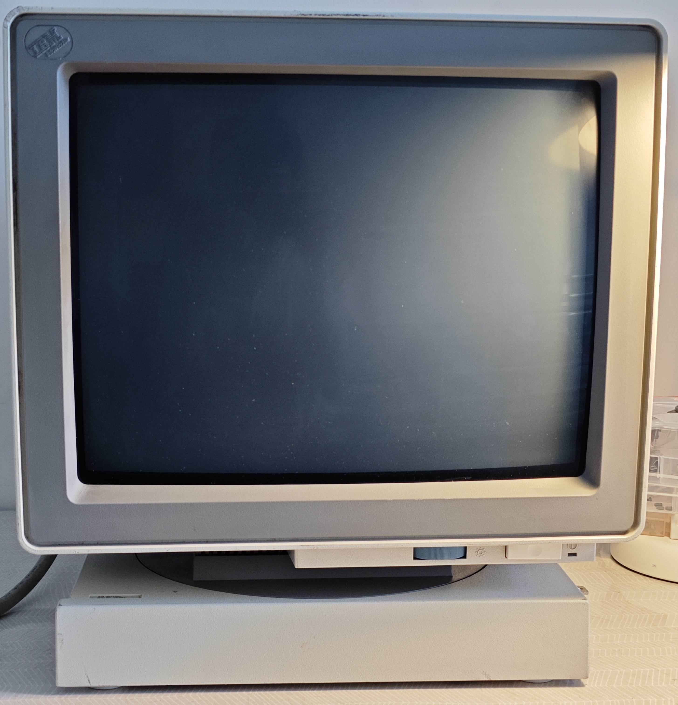
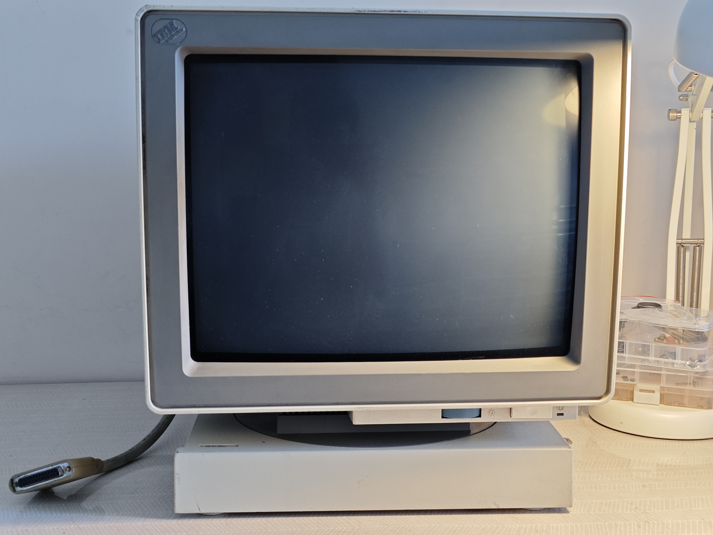
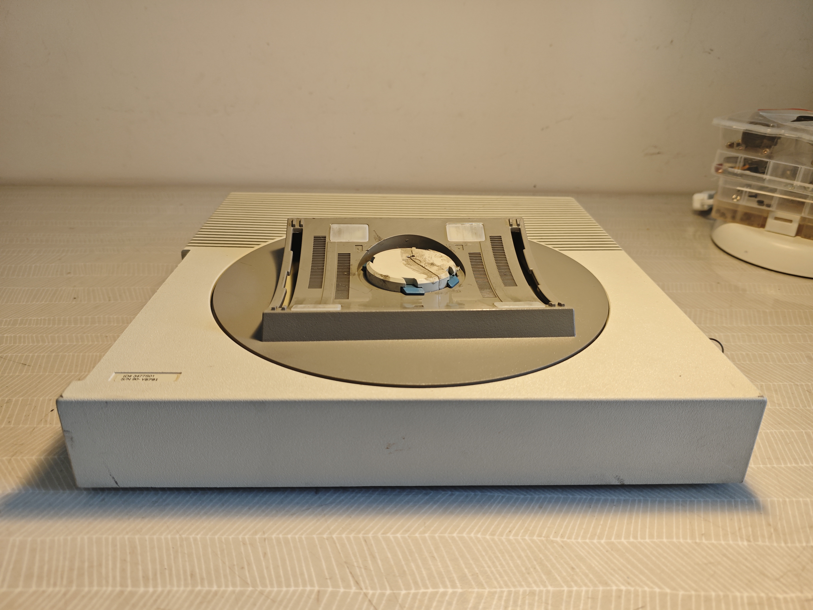
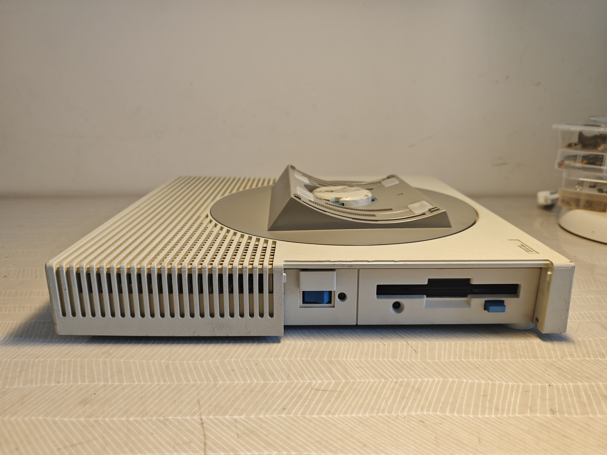
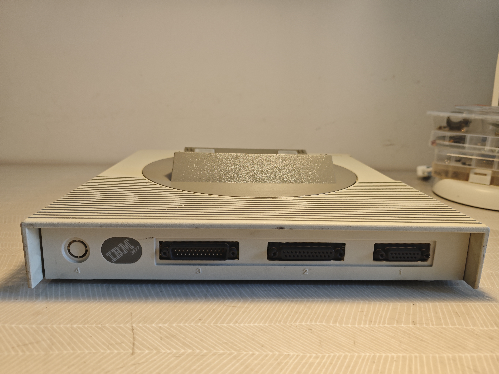
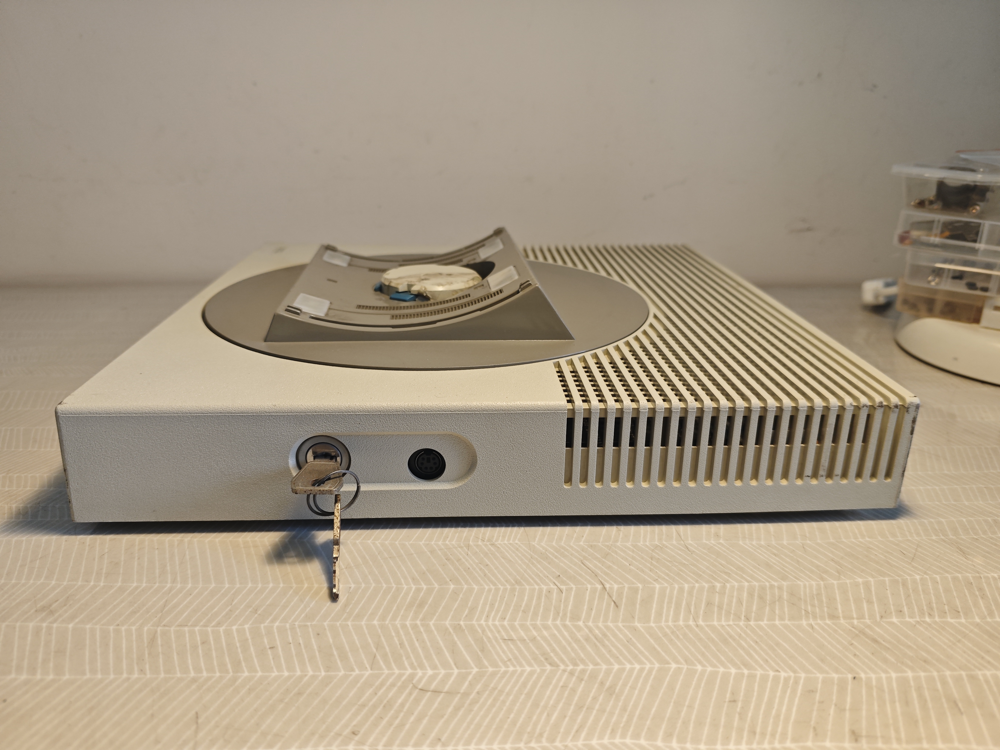
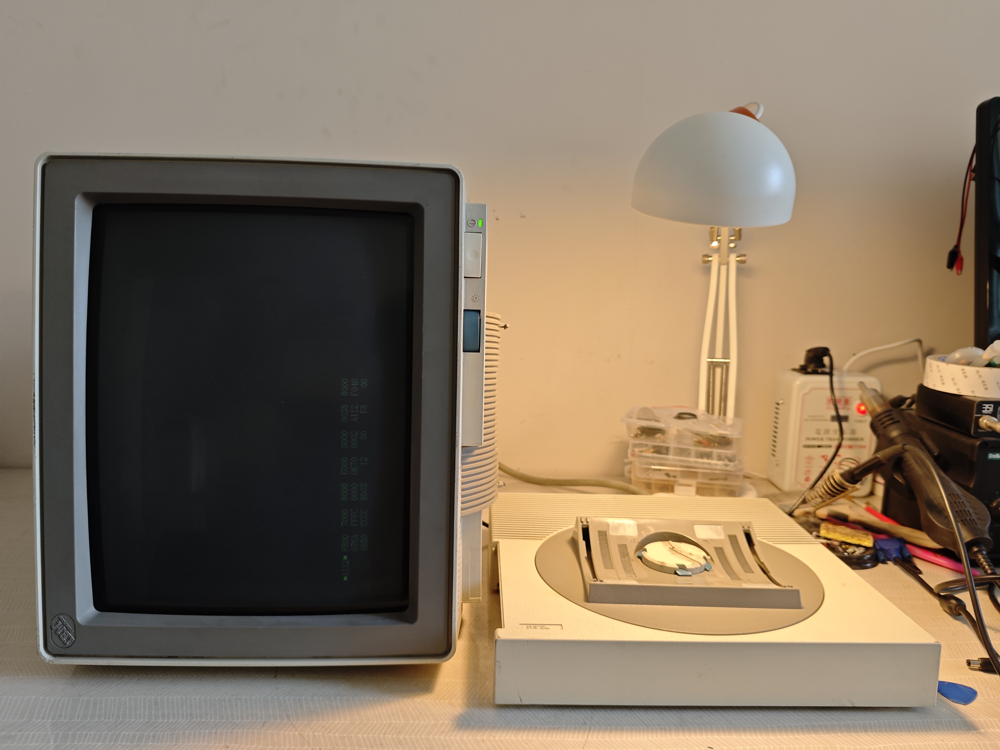
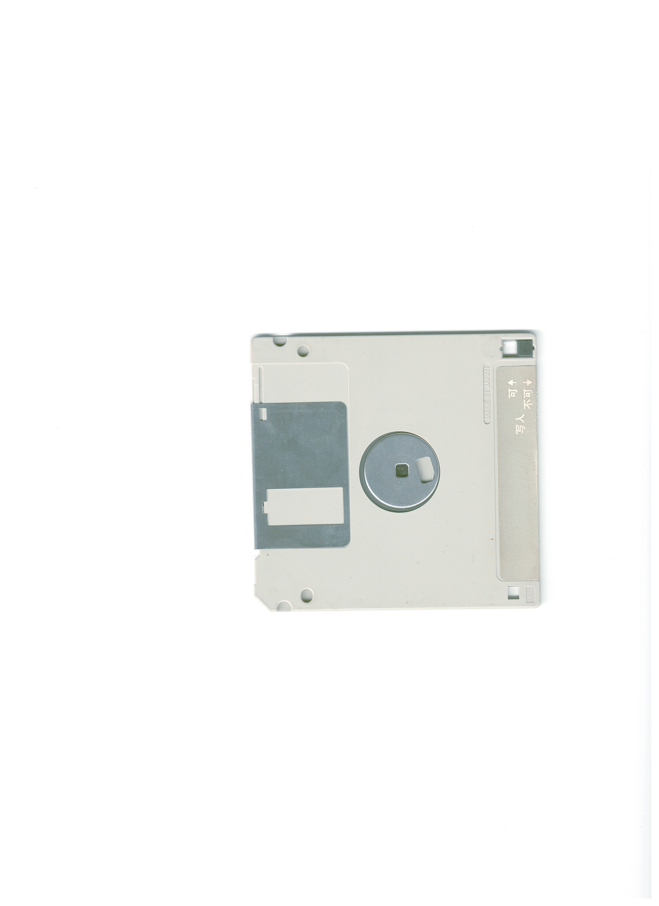
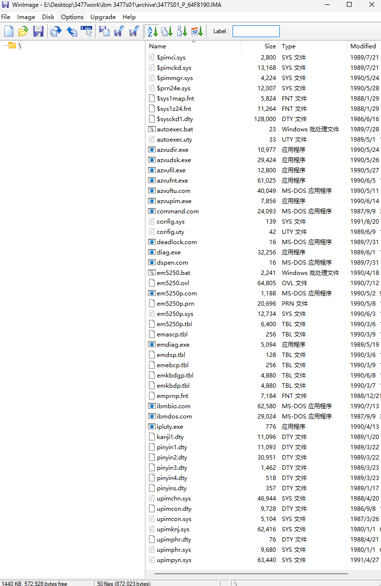
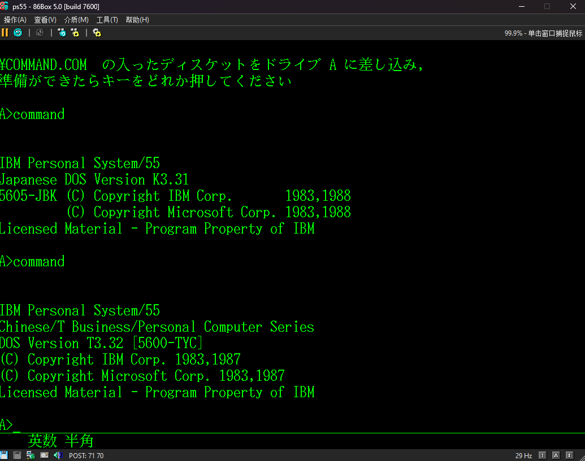

# IBM 3477-S
{:height="50%" width="50%"} 
# *本页面说的3477-S与普通3477 InfoWindow完全不同，请注意区分*

## 机型简述
IBM 3477-S本质上是一台简化的彩色Multistation，官方名叫“3477-S中文工作站”，不过只在启动盘内建了5295终端仿真程序，大致只是类似于5295-G终端定位。 
### 配置
CPU 80186-12 
显示 Multistation 彩色（部分是单色显示器） 
内存 128K?? 
硬盘 无 
软驱 1.44MB 
键盘 5576-001(或002?) 

## 当前机器简述
开机后提示A112，在进入Test模式后一直重置键盘并设置扫描码。（见下图） 
 

## 其他关于本机的信息
本机是极少使用5576键盘的Multistaion，并且发布于1991，属于Multisation生命及末期。
 

## 照片
### 主机

### 主板

### 开机

 

## 关于启动盘
本机自带了一张启动盘：
 {: width="40%"}{: width="40%"} 
已经通过GW备份，并传到 Archive.org 。
下载连接：[3477-S Boot Disk](./64F8190_GW.7z) 

打开镜像后可以看到以下文件：
 {: width="40%"} 
可以看到内置了拼音及IBM专有输入法，以及简体中文版5250模拟器。

在使用86Box模拟PS/55并启动到DOS K3.31后，启动Command.com可以看到如下提示：
 {: width="80%"} 
可以明显看到本镜像是基于DOS T3.32的，是繁体中文版而不是简体中文版。
但是前面的拼音输入法等又表明这确实是简中版。

另外执行dir后，可以看到中文区域是乱码：
 {: width="80%"} 
切换到繁中ROM后依旧乱码，推测3477-S的字体ROM与繁中PS/55不同，有可能是因为简中和繁中ROM不同，或者Multistation和PS/55ROM不同。 
*本机字体ROM尚未备份！*

## IPL(BIOS?)备份
下载链接：[IPL3477S](./3477s.7z) 