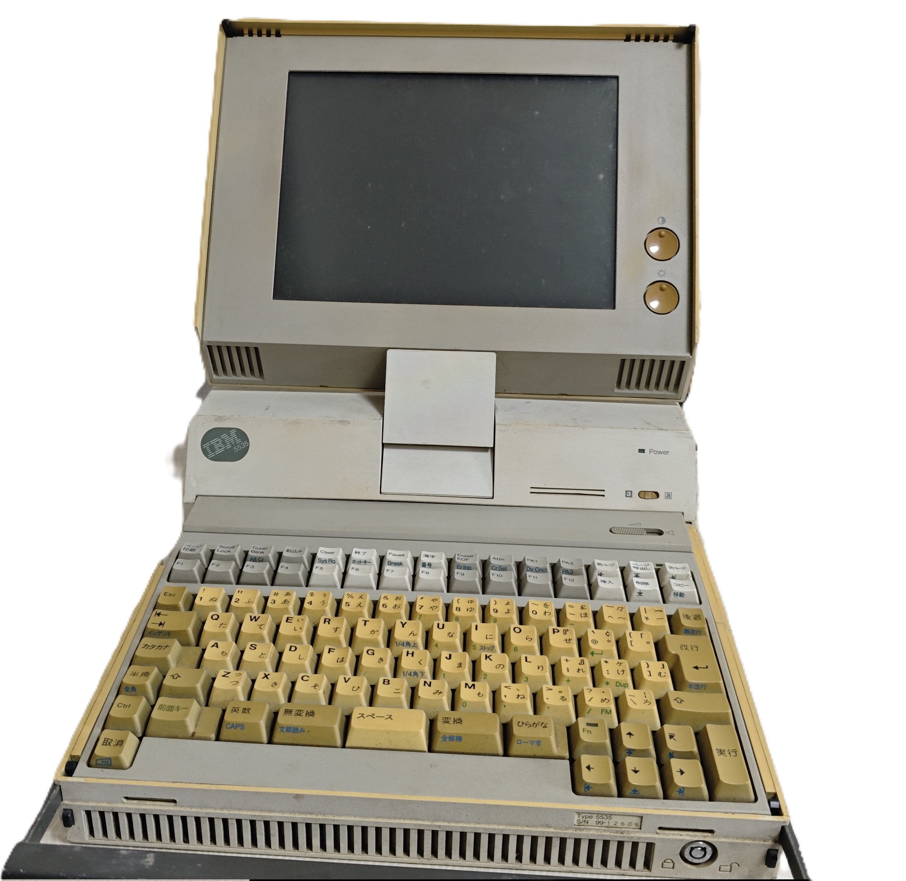

# IBM 5535-M
{:height="50%" width="50%"} 

## 机型简述
IBM 5535-M是Multistation的便携式版本，也是5535家族的第一款机型，搭配单色720*512STN屏幕，286-10 CPU和板载256K内存。 

## 当前机器简述
无法开机，TEST灯常亮。 
### 本机特殊点
从下面内部图片可以看出，本机与网上其他机型均不同。
本机的电源灯与[ardent-tool记载的的两台机子](https://www.ardent-tool.com/IBM_5550/5535/)以及[ret.rocks的机子](https://ret.rocks/index.php/early-portables/5535-multistation)的电源灯位置均不同
主板（见下图）和[ardent-tool的其中一台机子](https://www.ardent-tool.com/IBM_5550/5535/)内部主板图不同
机身前面的SN贴纸只写了5535，并没有写明5535-M，结合芯片生产日期，大概推测出这可能是后期IBM为了混淆（？）PS/55和Multistation的概念，抹掉了-M，并且对内部进行了调整。
 

## 其他关于本机的信息
蜂鸣器通过键盘连接，和5556极为相似。
另外值得一提的是，硬盘用的是与PS/2 30类似的类IDE ESDI硬盘，并不是其他奇奇怪怪的MFM硬盘。
另外关于Betaarchive上的5535“PS/55”KDOS镜像，启动扇区其实是Multistation格式，也就是说，那张盘其实是5535-M的启动盘，这也是IBM在Multisation生命后期试图混淆PS/55和Multistation的一个佐证。
 

## 内部照片
### 主板、显卡和内存扩展版
{:height="50%" width="50%"}
{:height="50%" width="50%"}
### 硬盘
{:height="50%" width="50%"}
{:height="50%" width="50%"}
### Token-Ring卡
{:height="50%" width="50%"}
{:height="50%" width="50%"}
### 键盘
{:height="50%" width="50%"}
{:height="50%" width="50%"}
 

