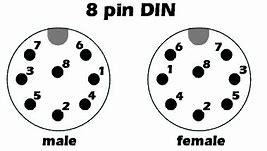

# IBM 5551-G
 

## 机型简述(改自维基百科)
IBM 5550是IBM于 20 世纪 80 年代和 90 年代在日本、韩国和中国销售的一款个人计算机系列，主要面向商务用户。该系列于 1983 年在日本推出，并以“Multistation 5550”的名称进行推广，因为它在一台机器中兼具三种功能：个人计算机、文字处理机以及IBM主机连接终端。 

## 当前机器简述
2021年收入，外壳不可用。无配套显示器（IBM 5555），配套键盘（IBM 5556），无法全部测试。 
通电后硬盘旋转，软驱电机一直旋转（无法确定是否正常），主板后面自检灯（应该是）闪烁后红灯熄灭，示波器测量显示卡类DIN-8接口有H-Sync,V-Sync,单色视频信号输出，应为数字TTL输出 

## 内部照片
### 主板
 
 
### 显示板
 
 
### 硬盘
 
 
### 软驱
 
 
### AST扩展卡
 
^55I/O PAK SS(串口卡)
 
^AST RAM PLUS(应为256K内存扩展卡)
### 整机
 
 
 

## 视频标准
视频输出使用类似DIN-8接口，但并非DIN-8，机器上的接口Pin6 Pin7比DIN-8接口稍往外倾。 
 
^DIN-8接口 
下面是我测量的信号 
Pin4->30.4Khz->猜测为H-Sync 
Pin5->72.4Hz->猜测为V-Sync 
Pin7->杂乱的较高频信号，大概为单色视频信号 
其他基本是接地，有空脚 
 
这个频率与VGA的Sync频率很接近，我直接把3条线和接地接到了显示器，不过我的显示器似乎无法与信号同步。可能是因为电平需要反转，不过懒得弄了 

## 杂谈
【1】其实本机制造商并不是IBM，甚至不是IBM Japan，而是由松下代工，包括主板、显卡、基板甚至软驱，还有大部分芯片也来自松下
【2】整机的设计并不给人一种“IBM PC”的感觉，而是一种小型机或者工作站的感觉
【3】这台机子有搭配三软驱的早期版本，这放在整个PC兼容机都是很炸裂的
【4】显卡的现存是256K，和系统内存一样，分辨率可以达到单色1024*768，四色360*512，比大力神好很多
【5】由于这台机器的CPU是8086，不同于8088，8086有16位外部总线，所以扩展卡总线也和ISA不一样
【6】似乎这机子也可以接AT/XT键盘（？未证实