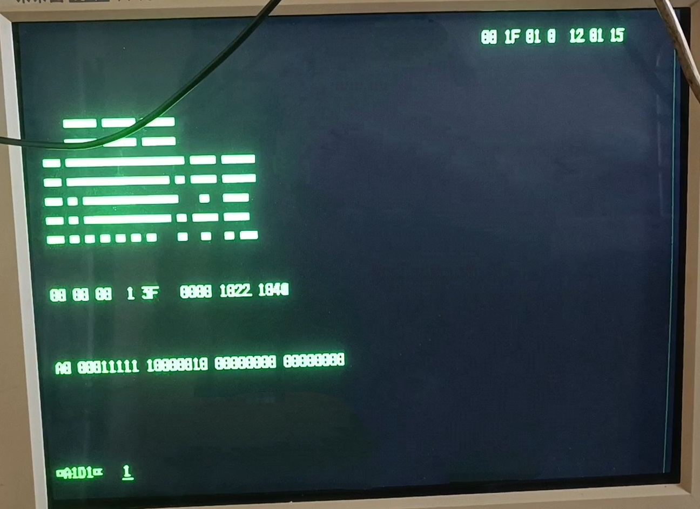

# IBM 5551-G
 

## 机型简述(改自维基百科)
IBM 5550是IBM于 20 世纪 80 年代和 90 年代在日本、韩国和中国销售的一款个人计算机系列，主要面向商务用户。该系列于 1983 年在日本推出，并以“Multistation 5550”的名称进行推广，因为它在一台机器中兼具三种功能：个人计算机、文字处理机以及IBM主机连接终端。 

## 当前机器简述
2021年收入，外壳不可用。无配套显示器（IBM 5555），配套键盘（IBM 5556），无法全部测试。 
通电后硬盘旋转，软驱电机一直旋转（无法确定是否正常），主板后面自检灯（应该是）闪烁后红灯熄灭，示波器测量显示卡类DIN-8接口有H-Sync,V-Sync,单色视频信号输出，应为数字TTL输出 
测试能显示A111错误，并且能进入Test模式。 

## 内部照片
### 主板
 
 
### 显示板
 
 
（疑似有两组显存，一组SRAM，一组DRAM，推测其中一组为存放字体“ROM”用） 
### 硬盘
 
 
（机子刚拿到时候声音大概正常，现在似乎启动声音不是很正常） 
### 软驱
 
 
### AST扩展卡
 
^55I/O PAK SS(串口卡)
 
^AST RAM PLUS(应为256K内存扩展卡)
### 整机
 
 
 

## 视频标准
视频输出使用类似DIN-8接口，但并非普通DIN-8，机器上的接口Pin6 Pin7比普通DIN-8接口稍往外倾。 
 
^DIN-8接口 
下面是我测量的信号 
Pin4->30.4Khz->猜测为H-Sync 
Pin5->72.4Hz->猜测为V-Sync 
Pin7->杂乱的较高频信号，大概为单色视频信号 
其他基本是接地，有空脚 
 
这个频率与VGA的Sync频率很接近，我直接把3条线和接地接到了显示器，不过我的显示器似乎无法与信号同步。 

## 启动
在发现PS/55使用隔行扫描信号并且只有CRT兼容此种信号后，使用CRT按以上线序连接后，显示键盘未连接（A111）错误。 
 
而在拨动TEST拨杆后，进入了测试模式 
 
而本机所需的5556键盘资料少，我不知道在主机询问键盘时应该应答什么，所以无法制作转接器。 

## 杂谈
<b>如果你知道5556键盘具体细节，请联系我。</b>
【1】其实本机制造商并不是IBM，甚至不是IBM Japan，而是由松下代工，包括主板、显卡、基板甚至软驱，还有大部分芯片也来自松下 
【2】整机的设计并不给人一种“IBM PC”的感觉，而是一种小型机或者工作站的感觉，是因为本机基于DisplayWriter开发，开发早于IBM PC发布 
【3】这台机子有搭配三软驱的早期版本 
【4】显卡的现存是256K，和系统内存一样，分辨率可以达到单色1024*768，四色360*512 
【5】由于这台机器的CPU是8086，不同于8088，8086有16位外部总线，所以扩展卡总线也和ISA不一样 
【6】软驱和硬盘分别改自Shugart(标准PC软驱)接口，MFM接口，应该只是改了物理接口 
【7】5550使用类AT协议键盘，但5550早于IBM AT 

## 更新
【20241013】初版
【20250315】更新亮机后相关事宜