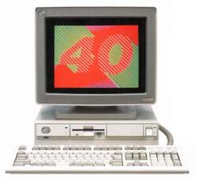
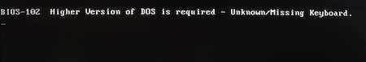

# IBM PS/55 5541-TC4
   

PS/55是IBM日本公司于1987年发布的个人电脑系列。PS/55 是IBM Multistation的后继产品，但其架构基于IBM PS/2。基于PS/2 Model 80的5570-S（话说这5570也是离奇的存在 https://diarywind.com/blog/e/ibm-ps5570s-spec.html ）除外，该系列的第一批产品由重新命名的 5550 型号组成。与 PS/2 不同，大多数基于 PS/55 的型号都具有32位（80386或80486）CPU 和MCA总线，适用于高端商业计算市场。由于IBM JX失败，日本IBM犹豫是否向消费者销售个人电脑。AT总线型号于1991年面向家庭用户发布。 

## 当前机器简述
2021年末收入，外壳被暴力快递摔碎了。无配套显示器和键盘，但是由于类似PS/2，用VGA显示器和PS/2键鼠可以将就用一下，不过无法使用本机的全部功能。 
机器的软驱似乎工作不正常，有时无法启动参考盘，修理之后彻底不读盘了。之后使用了 https://github.com/mdehling/p7x-floppy-adapter 的转接器，将普通软驱转成PS/2（PS/55）可用的软驱接口。转接器仅焊接一个电阻就能使用。 
这个机器是中文机（繁体），显卡字体ROM位置焊接全部两个EEPROM，日版机只有一个（ https://www.ardent-tool.com/PS55/video/DA_B_II_New_Photo_Front.jpg ）。 
本机显卡在有些模式下会使用到1024*768隔行扫描分辨率，如果将系统切换到中文模式，会在启动时检测是否为5576键盘。 

## 照片
### 主机
 
 
 
 
 
 
 
### 内部
 
### 内存提升卡（共三个插槽，有一个在主板上）
 
### 内存条（4M）
 
### 显卡（DisplayAdapter-B2）
 
 
### 硬盘、MCA提升卡
 
 
### 主板
 
### 原装软驱
 
 

## 随机软件
### DOS T5.01
本机自带的系统是PC DOS T5.01，是繁体中文版（P：简中  T：繁中  H：韩文） 
默认进入英文模式，使用Switch.bat切换中英环境，大致作用是替换中英环境的CONFIG.SYS和AUTOEXEC.BAT，并修改引导扇区。 
#### 进入系统
如果你在英文模式下，使用标准VGA显示器和PS/2键盘完全正常。 
在切换到中文模式下，如果你使用标准PS/2键盘，将会收到键盘错误，显示BIOS-102，但这并不是BIOS发出的消息，而是由切换到中文环境下的引导扇区发出的。推测此系统基于JDOS而不是DOS/V 
 
^没时间拍了，借一下diarywind.com的图  
检测键盘时似乎仅检测键盘ID，并且由于中文模式使用的8Ah扫描码与标准03h扫描码完全不同，所以需要转译扫描码。 
为此，我正在制作一个转接器，可以将PS/2转换为5576-002键盘ID以及键盘扫描码转换。 
并且由于中文模式使用1024*768隔行扫描，LCD显示器基本都不支持此显示模式，我需要连接一个CRT显示器（我用的LG T710S）才能显示。 
现在已经可以进入中文模式，以下是系统截图： 
 
 
 
### Micro CADAM
本软件是CADAM公司给IBM做的CAD软件，似乎仅使用与55xx系列（可能包括Multistation）
打开主程序后一直显示内存不足，我确定XMS内存为3M，大于要求的2.5M。不知道为什么一直报错。
 
 
    
我已经把硬盘中的根目录文件、PS2文件夹文件（相当于正常DOS中的英文DOS文件夹）、DOS文件夹文件较完整Dump，已经上传至Archive。MCADAM有待上传。 

## 其他
【1】磁盘没有完整备份，如果你知道怎么完整DUMP这种ESDI硬盘，请联系我！！！！！！ 
【2】就一个蜂鸣器有必要带音量旋钮嘛（） 
【3】PS/2到5576转接器制作中...... 