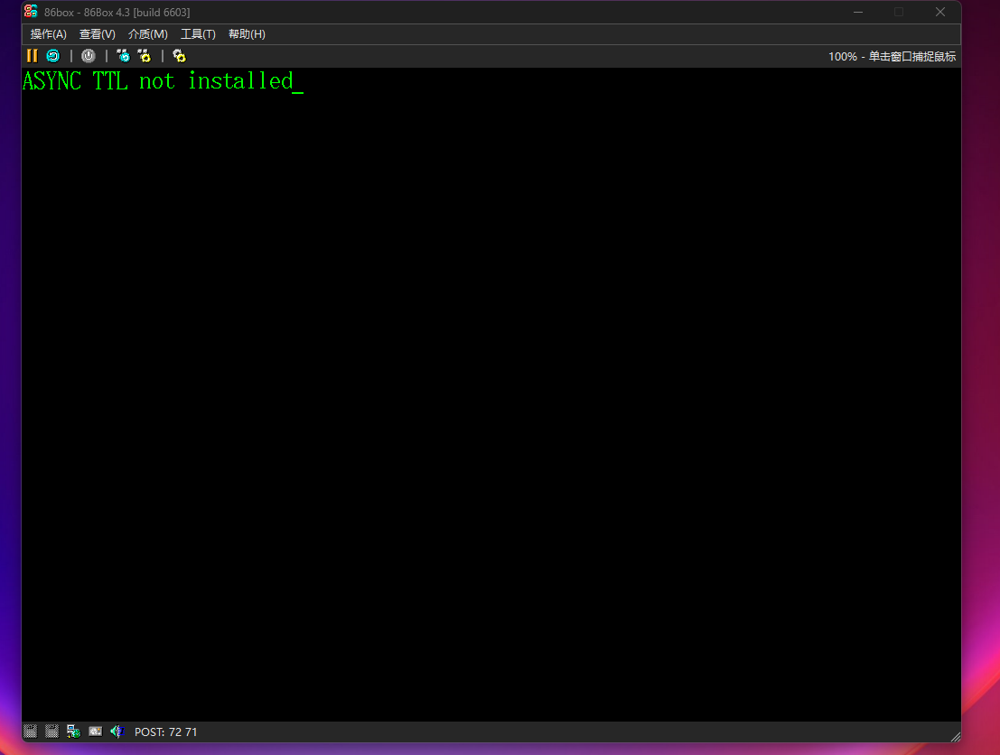
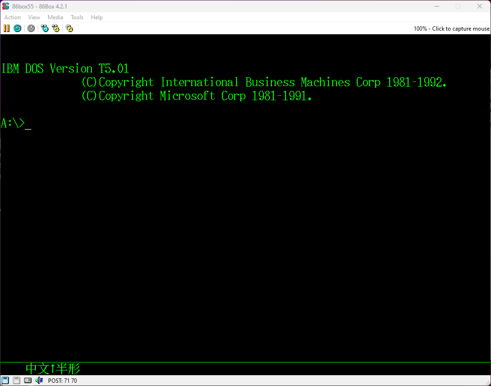

# IBM PS/55 5541-TC4
   

PS/55是IBM日本公司于1987年发布的个人电脑系列。PS/55 是IBM Multistation的后继产品，但其架构基于IBM PS/2。基于PS/2 Model 80的5570-S除外，该系列的第一批产品由重新命名的 5550 型号组成。与 PS/2 不同，大多数基于 PS/55 的型号都具有32位（80386或80486）CPU 和MCA总线，适用于高端商业计算市场。由于IBM JX失败，日本IBM犹豫是否向消费者销售个人电脑。AT总线型号于1991年面向家庭用户发布。 

## 当前机器简述
2023年收入（记不太清了），外壳被暴力快递摔碎。无配套显示器和键盘，但是由于类似PS/2，用VGA显示器和PS/2键鼠可以将就用一下，不过无法使用本机的全部功能。 
机器的软驱似乎工作不正常，有时无法启动参考盘，修理之后彻底不读盘了。之后使用了 https://github.com/mdehling/p7x-floppy-adapter 的转接器，将普通软驱转成PS/2（PS/55）可用的软驱接口。转接器仅焊接一个电阻就能使用。 
这个机器是中文机（繁体），显卡字体ROM位置焊接全部两个EEPROM，日版机只有一个（ https://www.ardent-tool.com/PS55/video/DA_B_II_New_Photo_Front.jpg ）。 
本机显卡在有些模式下会使用到1024*768隔行扫描分辨率，如果将系统切换到中文模式，会在启动时检测是否为5576键盘。 

## 照片
### 主机
 
 
 
 
 
 
 
### 内部
 
### 内存提升卡（共三个插槽，有一个在主板上）
 
### 内存条（4M）
 
### 显卡（DisplayAdapter-B2）
 
 
### 硬盘、MCA提升卡
 
 
### 主板
 
### 原装软驱
 
 

## 随机软件
已将硬盘完整DUMP RAW镜像 
### DOS T5.01
本机自带的系统是PC DOS T5.01，是繁体中文版（P：简中  T：繁中  H：韩文） 
默认进入英文模式，使用Switch.bat切换中英环境，大致作用是替换中英环境的CONFIG.SYS和AUTOEXEC.BAT，并修改引导扇区。 
#### 进入系统
如果你在英文模式下，使用标准VGA显示器和PS/2键盘完全正常。 
在切换到中文模式下，如果你使用标准PS/2键盘，将会收到键盘错误，显示BIOS-102，但这并不是BIOS发出的消息，而是由切换到中文环境下的引导扇区发出的。推测此系统基于JDOS而不是DOS/V 
 
^没时间拍了，借一下diarywind.com的图  
检测键盘时似乎仅检测键盘ID，并且由于中文模式使用的8Ah扫描码与标准03h扫描码完全不同，所以需要转译扫描码。 
为此，我正在制作一个转接器，可以将PS/2转换为5576-002键盘ID以及键盘扫描码转换。 
并且由于中文模式使用1024*768隔行扫描，LCD显示器基本都不支持此显示模式，我需要连接一个CRT显示器（我用的LG T710S）才能显示。 
现在已经可以进入中文模式，以下是系统截图： 
 
 
 
### Micro CADAM
本软件是CADAM公司给IBM做的CAD软件，似乎仅使用与55xx系列（可能包括Multistation） 
打开主程序后一直显示内存不足，我确定XMS内存为3M，大于要求的2.5M。 
 
 
之后发现原机使用QEMM，于是更换QEMM跳过内存错误后，出现ASYNC未安装错误 
猜测ASYNC为 https://www.ardent-tool.com/comms/TTL_Async.html 中的扩展卡，与早期LPFK一起使用。 
 

## 模拟
86Box55已经合并到86Box主线，并添加繁中支持。 
将镜像挂载至86Box 4.3（截至250315无正式版）并选择5550-T,勾选PS/55 DA选项，并在PS/55DA配置中选择繁体中文 
 （虽然截图使用的是86Box55，但86Box 4.3操作几乎相同） 
    

## 系统和ROM下载
### OS
[IBM PC DOS T5.01](https://archive.org/details/pcdost-5-sys-harddisk-img) 
### BIOS
[IBM 5541 BIOS(95F4451)](./files/BIOS_95F4451.BIN) 
### Character ROM
[Traditional Chinese Character ROM(2 IC)](./files/FONT_FULL.BIN) 
[Traditional Chinese Character ROM(95F4224)](./files/FONT_95F4224_U11.BIN) 
[Traditional Chinese Character ROM(95F4223)](./files/FONT_95F4223_U12.BIN) 

## 其他
【1】标准PS/2转5576转接器请到PS2276项目 
【2】[B站视频](https://www.bilibili.com/video/BV1eiRYYfEU7) 有些过程没有展示（例如更换软驱、电容等） 

## 更新
【20241013】初版 
【20241020】修改启动中文模式后信息 
【20250315】添加ROM以及模拟等信息 