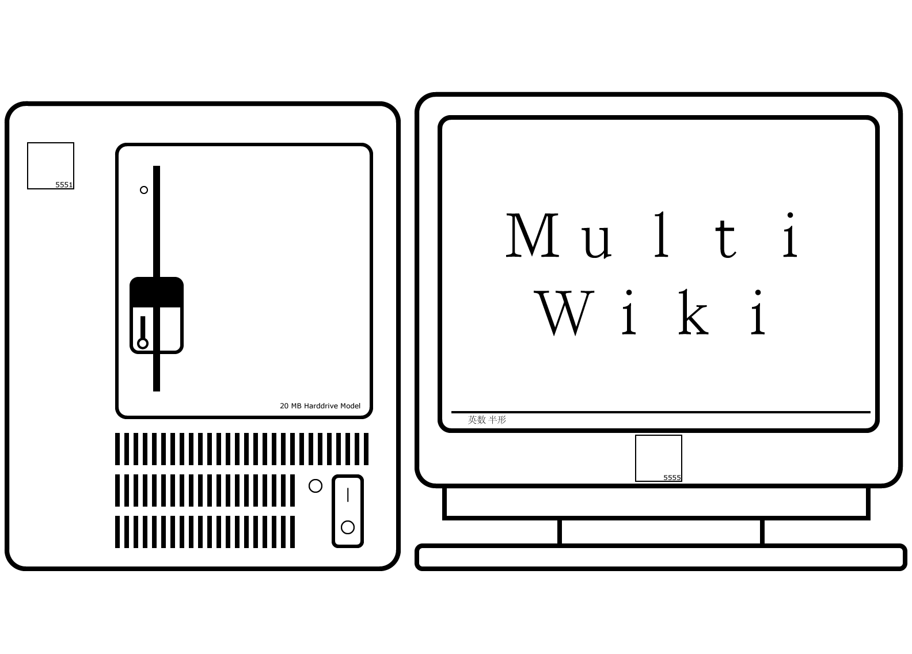
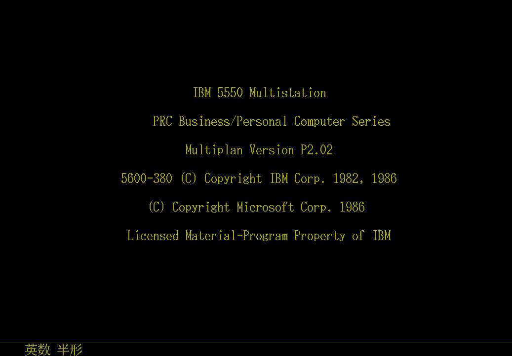

  
 <h1>MultiWiki</h1>
 
Multistation、PS/55及DOS/V软件(操作系统)维基

  <table>
   <td>
    <h1>操作系统</h1>
    <a href="./os/" target="_blank">
      
    </a>
   </td>
   <td>
    <h1>应用软件</h1>
    <a href="./software/" target="_blank">
      
    </a>
   </td>
  </table>

