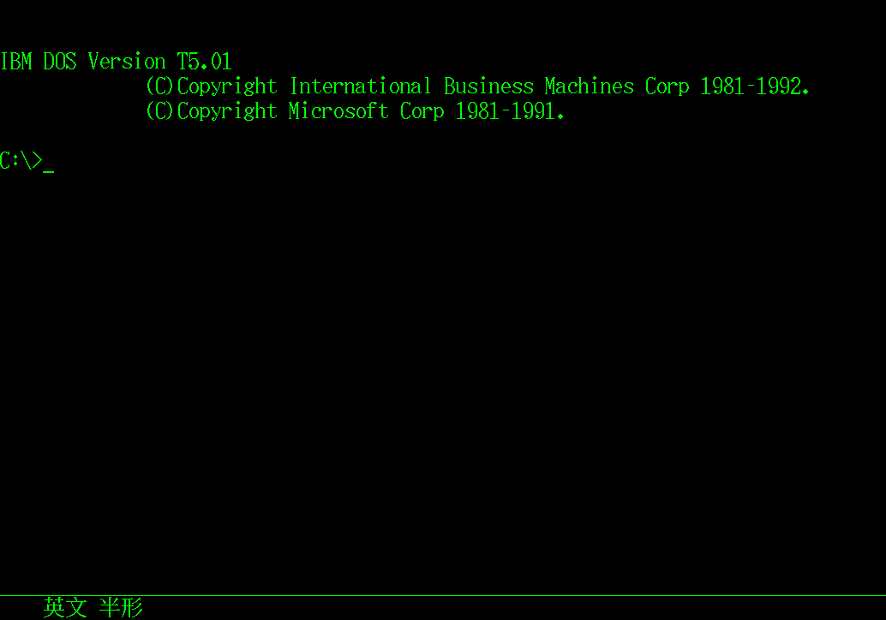

  
 <h1>MultiWiki - 操作系统</h1>
 
IBM PC-DOS K/P/T/H/J(/V)维基

 <h1>IBM PC-DOS K/P/T/H/J是什么......</h1>
 

  IBM PC-DOS K/P/T/H最开始是IBM Japan为Multistation编写的系统，K/P/T/H为不同语言。一般情况下DOS K/P/T/H的版本要大于系统基于的英文DOS。DOS K后来调整了部分结构，更名为DOS J。不同于前期非/V的版本只能在Multistation或IBM PS/55使用，DOS/V为后期VGA成熟后利用VGA在PCAT上显示亚洲文字的系统。以下为语言对照： 
  <table border="1">
   <tr>
    <td>K/J</td>
    <td>日文</td>
   </tr>
   <tr>
    <td>P</td>
    <td>简体中文</td>
   </tr>
   <tr>
    <td>T</td>
    <td>繁体中文</td>
   </tr>
   <tr>
    <td>H</td>
    <td>韩文</td>
   </tr>
  </table>
 

 <h1>版本列表</h1>
 

  <table>
   <tr>
    <td>软件编号</td>
    <td>名称</td>
    <td>架构</td>
    <td>状态</td>
   </tr>
   <tr>
    <td></td>
    <td align="center">日文</td>
    <td></td>
    <td></td>
   </tr>
   <tr>
    <td>5600-???</td>
    <td><a href="./k200/" target="_blank" >IBM Kanji DOS K2.00</a></td>
    <td>Multistation</td>
    <td>🔴</td>
   </tr>
   <tr>
    <td>5600-???</td>
    <td><a href="./k212/" target="_blank" >IBM Kanji DOS K2.12</a></td>
    <td>Multistation</td>
    <td>🔴</td>
   </tr>
   <tr>
    <td>5600-JBP/JYP</td>
    <td><a href="./k220/" target="_blank" >IBM Kanji DOS K2.20</a></td>
    <td>Multistation</td>
    <td>🔴</td>
   </tr>
   <tr>
    <td>5600-JBD/JYD</td>
    <td><a href="./k260/" target="_blank" >IBM Kanji DOS K2.60</a></td>
    <td>Multistation</td>
    <td>🔴</td>
   </tr>
    <tr>
    <td>5600-JBD/*JYD*</td>
    <td><a href="./k270/" target="_blank" >IBM Kanji DOS K2.70</a></td>
    <td>Multistation</td>
    <td>🟡</td>
   </tr>
    <tr>
    <td>5600-JYD</td>
    <td><a href="./k271/" target="_blank" >IBM Kanji DOS K2.71</a></td>
    <td>Multistation</td>
    <td>🟢</td>
   </tr>
    <tr>
    <td>5600-JBC</td>
    <td><a href="./k320/" target="_blank" >IBM Kanji DOS K3.20</a></td>
    <td>Multistation</td>
    <td>🔴</td>
   </tr>
    <tr>
    <td>5600-JYC/JYN/5605-JZN</td>
    <td><a href="./k330/" target="_blank" >IBM Kanji DOS K3.30</a></td>
    <td>Multistation</td>
    <td>🔴</td>
   </tr>
    <tr>
    <td>5605-JBK</td>
    <td><a href="./k331/" target="_blank" >IBM Kanji DOS K3.31</a></td>
    <td>PS/55</td>
    <td>🟢</td>
   </tr>
    <tr>
    <td>560?-???</td>
    <td><a href="./k332/" target="_blank" >IBM Kanji DOS K3.32</a></td>
    <td>?</td>
    <td>🔵</td>
   </tr>
    <tr>
    <td>5606-JYN/5600-JZN</td>
    <td><a href="./k340/" target="_blank" >IBM Kanji DOS K3.40</a></td>
    <td>Multistation</td>
    <td>🔴</td>
   </tr>
    <tr>
    <td>5600-JZN</td>
    <td><a href="./k344/" target="_blank" >IBM Kanji DOS K3.44</a></td>
    <td>Multistation/PS/55</td>
    <td>🟢</td>
   </tr>
    <tr>
    <td>560?-???</td>
    <td><a href="./k345/" target="_blank" >IBM Kanji DOS K3.45</a></td>
    <td>?</td>
    <td>🔵</td>
   </tr>
    <tr>
    <td>/</td>
    <td><a href="./j401/" target="_blank" >IBM PC DOS J4.01</a></td>
    <td>PS/55</td>
    <td>🟢</td>
   </tr>
    <tr>
    <td>/</td>
    <td><a href="./j404/" target="_blank" >IBM PC DOS J4.04</a></td>
    <td>PS/55</td>
    <td>🟢</td>
   </tr>
    <tr>
    <td>/</td>
    <td><a href="./j405/" target="_blank" >IBM PC DOS J4.05</a></td>
    <td>PS/55</td>
    <td>🟢</td>
   </tr>
    <tr>
    <td>/</td>
    <td><a href="./j405v/" target="_blank" >IBM PC DOS J4.05/V</a></td>
    <td>PCAT</td>
    <td>🟢</td>
   </tr>
    <tr>
    <td>/</td>
    <td><a href="./j406/" target="_blank" >IBM PC DOS J4.06</a></td>
    <td>PS/55</td>
    <td>🟢</td>
   </tr>
    <tr>
    <td>/</td>
    <td><a href="./j407/" target="_blank" >IBM PC DOS J4.07</a></td>
    <td>PS/55</td>
    <td>🟢</td>
   </tr>
    <tr>
    <td>/</td>
    <td><a href="./j407v/" target="_blank" >IBM PC DOS J4.07/V</a></td>
    <td>PCAT</td>
    <td>🟢</td>
   </tr>
    <tr>
    <td>/</td>
    <td><a href="./j408/" target="_blank" >IBM PC DOS J4.08</a></td>
    <td>PS/55</td>
    <td>🟢</td>
   </tr>
    <tr>
    <td>/</td>
    <td><a href="./j500v/" target="_blank" >IBM PC DOS J5.00/V</a></td>
    <td>PCAT</td>
    <td>🟢</td>
   </tr>
    <tr>
    <td>/</td>
    <td><a href="./j630v/" target="_blank" >IBM PC DOS J6.30/V</a></td>
    <td>PCAT</td>
    <td>🟢</td>
   </tr>
    <tr>
    <td>/</td>
    <td><a href="./j700v/" target="_blank" >IBM PC DOS J2000/V</a></td>
    <td>PCAT</td>
    <td>🟢</td>
   </tr>
   <tr>
    <td></td>
    <td align="center">简体中文</td>
    <td></td>
    <td></td>
   </tr>
   <tr>
    <td>5600-???</td>
    <td><a href="./p212/" target="_blank" >IBM HANZI DOS P2.12</a></td>
    <td>Multistation</td>
    <td>🔴</td>
   </tr>
   <tr>
    <td>5600-362</td>
    <td><a href="./p220/" target="_blank" >IBM HANZI DOS P2.20</a></td>
    <td>Multistation</td>
    <td>🟡</td>
   </tr>
   <tr>
    <td>5600-362</td>
    <td><a href="./p240/" target="_blank" >IBM HANZI DOS P2.40</a></td>
    <td>Multistation</td>
    <td>🟡</td>
   </tr>
   <tr>
    <td>5600-383</td>
    <td><a href="./p260/" target="_blank" >IBM HANZI DOS P2.60</a></td>
    <td>Multistation</td>
    <td>🔵</td>
   </tr>
   <tr>
    <td>5600-383</td>
    <td><a href="./p261/" target="_blank" >IBM HANZI DOS P2.61</a></td>
    <td>Multistation</td>
    <td>🟢</td>
   </tr>
   <tr>
    <td>/</td>
    <td><a href="./p630v/" target="_blank" >IBM PC DOS P6.3/V</a></td>
    <td>PCAT</td>
    <td>🔴</td>
   </tr>
   <tr>
    <td>/</td>
    <td><a href="./p700v/" target="_blank" >IBM PC DOS P2000/V</a></td>
    <td>PCAT</td>
    <td>🟢</td>
   </tr>
   <tr>
    <td></td>
    <td align="center">繁体中文</td>
    <td></td>
    <td></td>
   </tr>
   <tr>
    <td>5600-TYP</td>
    <td><a href="./t260/" target="_blank" >IBM DOS T2.6?</a></td>
    <td>Multistation</td>
    <td>🔴</td>
   </tr>
   <tr>
    <td>5600-TYC</td>
    <td><a href="./t332/" target="_blank" >IBM Chinese/T DOS T3.32</a></td>
    <td>Multistation(PS/55?)</td>
    <td>🟡</td>
   </tr>
   <tr>
    <td>/</td>
    <td><a href="./t501/" target="_blank" >IBM PC DOS T5.01</a></td>
    <td>PS/55</td>
    <td>🟢</td>
   </tr>
   <tr>
    <td>/</td>
    <td><a href="./t630v/" target="_blank" >IBM PC DOS T6.30/V</a></td>
    <td>PCAT</td>
    <td>🟢</td>
   </tr>
   <tr>
    <td>/</td>
    <td><a href="./t700v/" target="_blank" >IBM PC DOS T2000/V</a></td>
    <td>PCAT</td>
    <td>🟢</td>
   </tr>
   <tr>
    <td></td>
    <td align="center">韩文</td>
    <td></td>
    <td></td>
   </tr>
   <tr>
    <td>5600-KYC</td>
    <td><a href="./h323/" target="_blank" >IBM DOS H3.23</a></td>
    <td>Multistation</td>
    <td>🔵</td>
   </tr>
   <tr>
    <td>5600-???</td>
    <td><a href="./h323/" target="_blank" >IBM DOS H3.37</a></td>
    <td>Multistation</td>
    <td>🔴</td>
   </tr>
   <tr>
    <td>/</td>
    <td><a href="./h500/" target="_blank" >IBM PC DOS H5.00/K</a></td>
    <td>PS/55</td>
    <td>🔵</td>
   </tr>
   <tr>
    <td>/</td>
    <td><a href="./h500v/" target="_blank" >IBM PC DOS H5.00/V</a></td>
    <td>PCAT</td>
    <td>🔵</td>
   </tr>
  </table>
 

 

  注：🟢为全部组件可用，🟡为仅有COMMAND.COM或加部分组件，🔵为有软盘实物照片等资料，🔴为仅有资料表明大概有此版本
 

