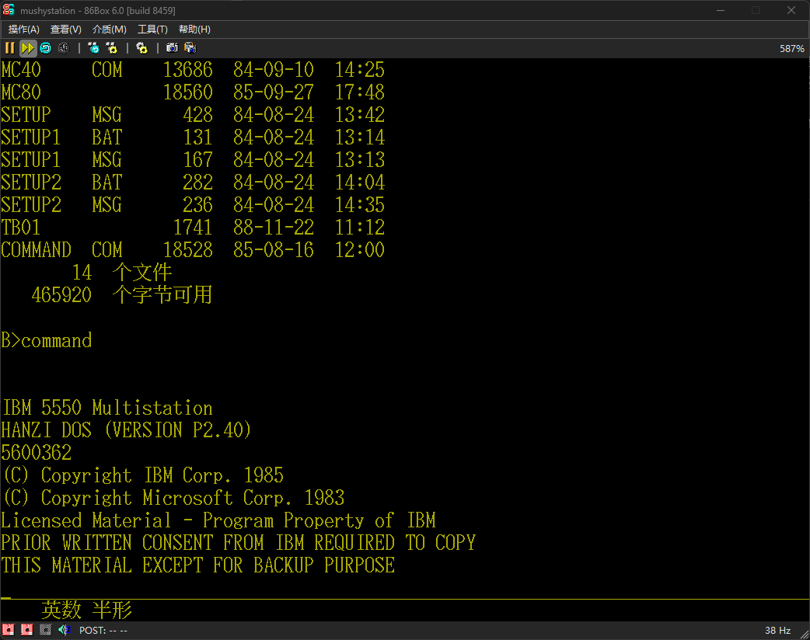

<head>
 
</head>

  
 <h1>IBM HANZI DOS P2.40</h1>
 
MultiWiki

 <table>
  <tr>
   <td>软件序号</td>
   <td>5600-362</td>
  </tr>
  <tr>
   <td>发布时间</td>
   <td>1985</td>
  </tr>
  <tr>
   <td>完整度</td>
   <td>仅COMMAND.COM</td>
  </tr>
  <tr>
   <td>媒体</td>
   <td>硬盘镜像</td>
  </tr>
 </table>

 

  <h1>简介</h1>
  

   IBM HANZI DOS P2.40 于 @时空访客 的硬盘上转储。
   本COMMAND.COM在硬盘的MC(MultiChart)文件夹发现，有可能是因为每张软件盘是可启动的，复制时复制时整个复制到了硬盘。 
   IBM DOS P2.20-2.61各个版本都有不能在COMMAND.COM启动另一个版本的COMMAND.COM的问题，导致启动显示版本后卡死。
   （直接替换COMMAND.COM可能解决本问题）
  

 

 

  <h1>截图与照片</h1>
  

   <table>
    <td>
     
COMMAND.COM

    </td>
   </table>
  

 

