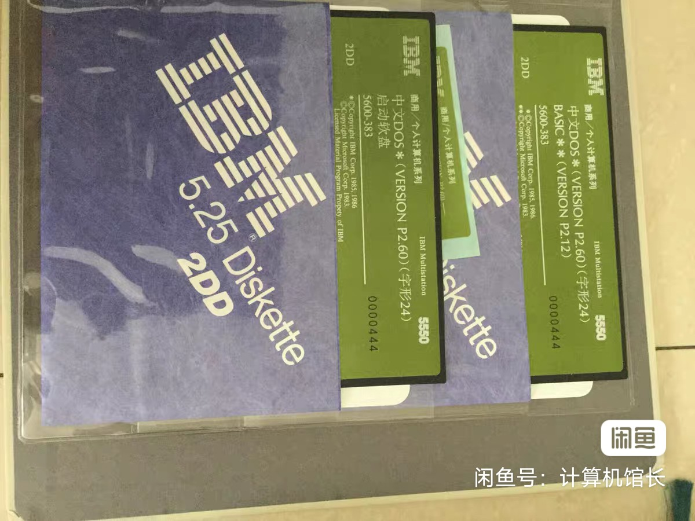
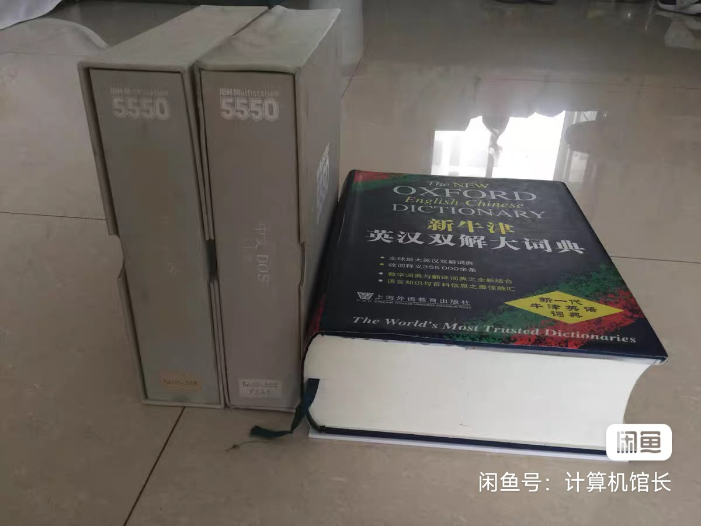
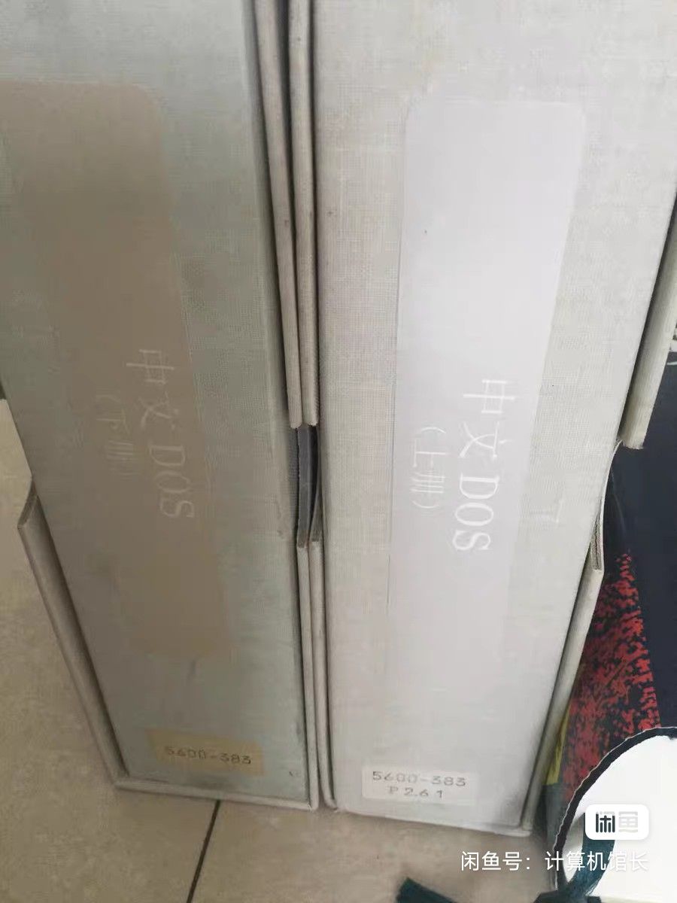
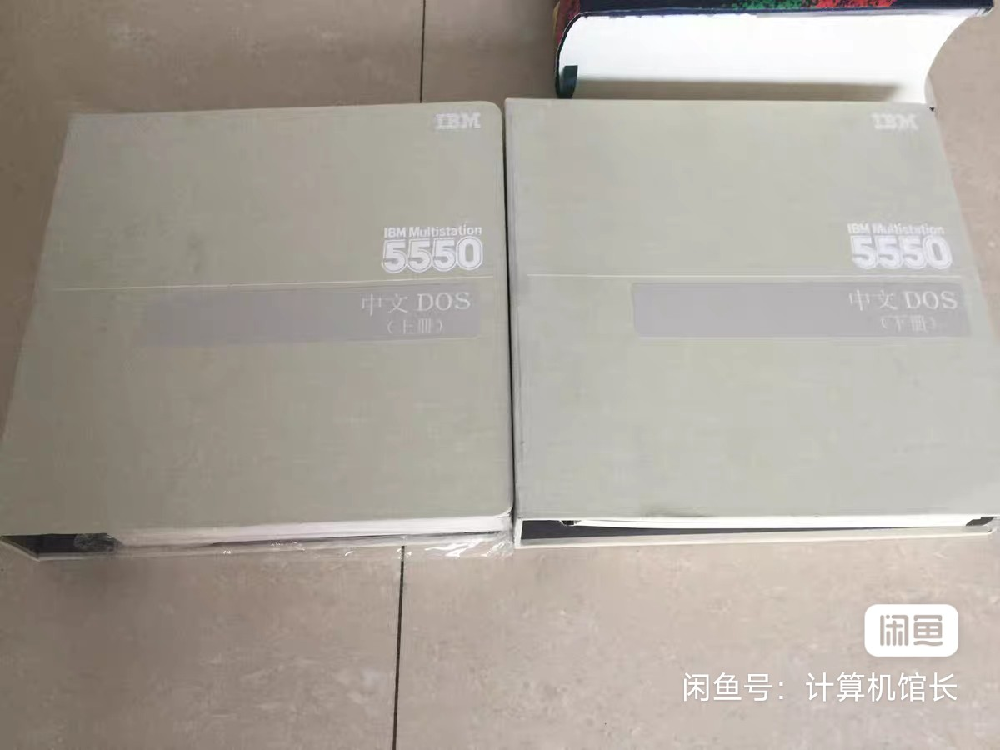
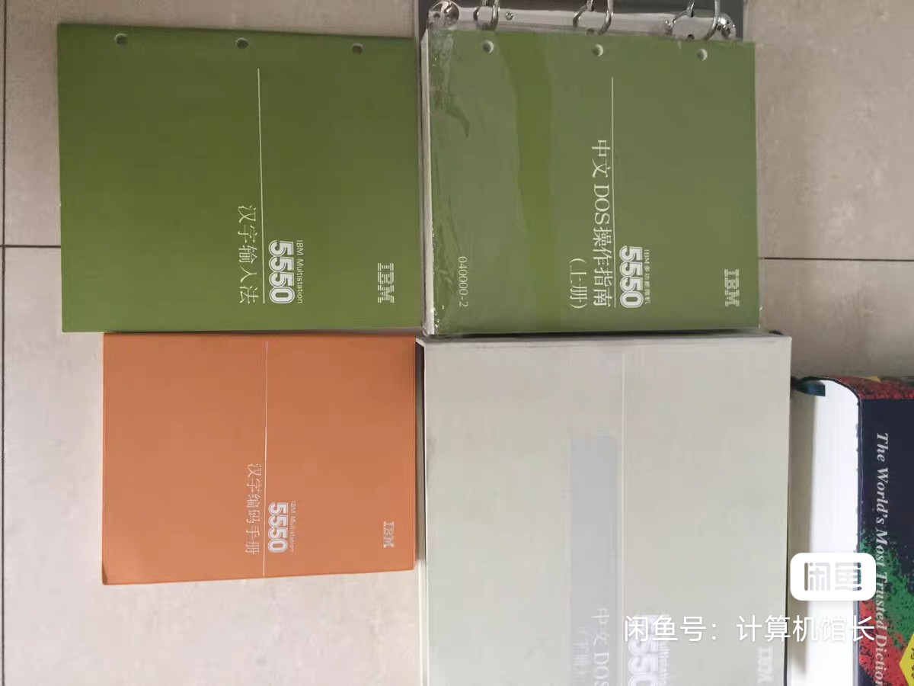

<head>
 
</head>

  
 <h1>IBM HANZI DOS P2.60</h1>
 
MultiWiki

 <table>
  <tr>
   <td>软件序号</td>
   <td>5600-383</td>
  </tr>
  <tr>
   <td>发布时间</td>
   <td>1985</td>
  </tr>
  <tr>
   <td>完整度</td>
   <td>仅信息</td>
  </tr>
  <tr>
   <td>媒体</td>
   <td>/</td>
  </tr>
 </table>

 

  <h1>简介</h1>
  

   IBM DOS P2.60仅在几年前在闲鱼有安装软盘售卖。
  

 

  <h1>截图与照片</h1>
  

   <table>
   <td>
     
磁盘

    </td>
    <td>
     
说明书 1

    </td>
    <td>
     
说明书 2

    </td>
    <td>
     
说明书 3

    </td>
    <td>
     
说明书 4

    </td>
   </table>
  

 

  <h1>参考</h1>
  

   <a href="https://www.goofish.com/item?id=575656661493" target="_blank" >闲鱼链接</a>
  

 

