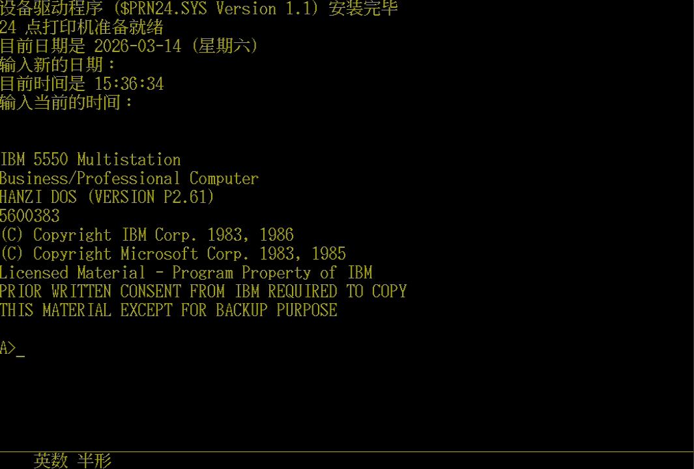
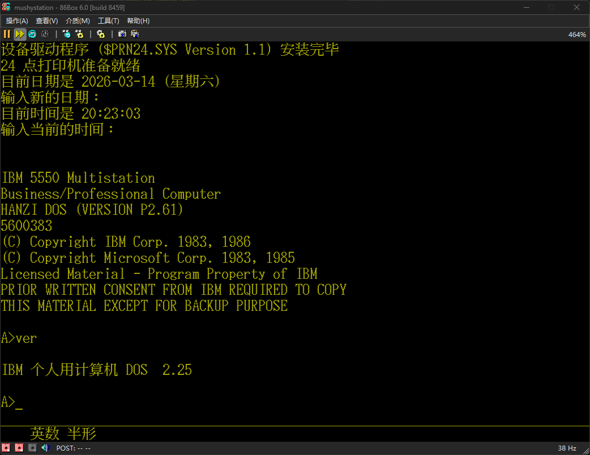

<head>
 
</head>

  
 <h1>IBM HANZI DOS P2.61</h1>
 
MultiWiki

 <table>
  <tr>
   <td>软件序号</td>
   <td>5600-383</td>
  </tr>
  <tr>
   <td>发布时间</td>
   <td>1985</td>
  </tr>
  <tr>
   <td>完整度</td>
   <td>完整</td>
  </tr>
  <tr>
   <td>媒体</td>
   <td>硬盘镜像</td>
  </tr>
 </table>

 

  <h1>简介</h1>
  

   IBM HANZI DOS P2.61为目前为止发现的最早的也是唯一一个完整的适用于Multistation的简体中文DOS。于 @时空访客 和我的硬盘上转储。
  

 

 

  <h1>镜像下载</h1>
  

   <a href="./pcdos-p2.61-5550-wtools_720k525.IMA" target="_blank" >IBM HANZI DOS P2.61 重构软盘</a>
  

 

 

  <h1>截图与照片</h1>
  

   <table>
    <td>
     
COMMAND.COM

    </td>
    <td>
     
Ver

    </td>
   </table>
  

 

