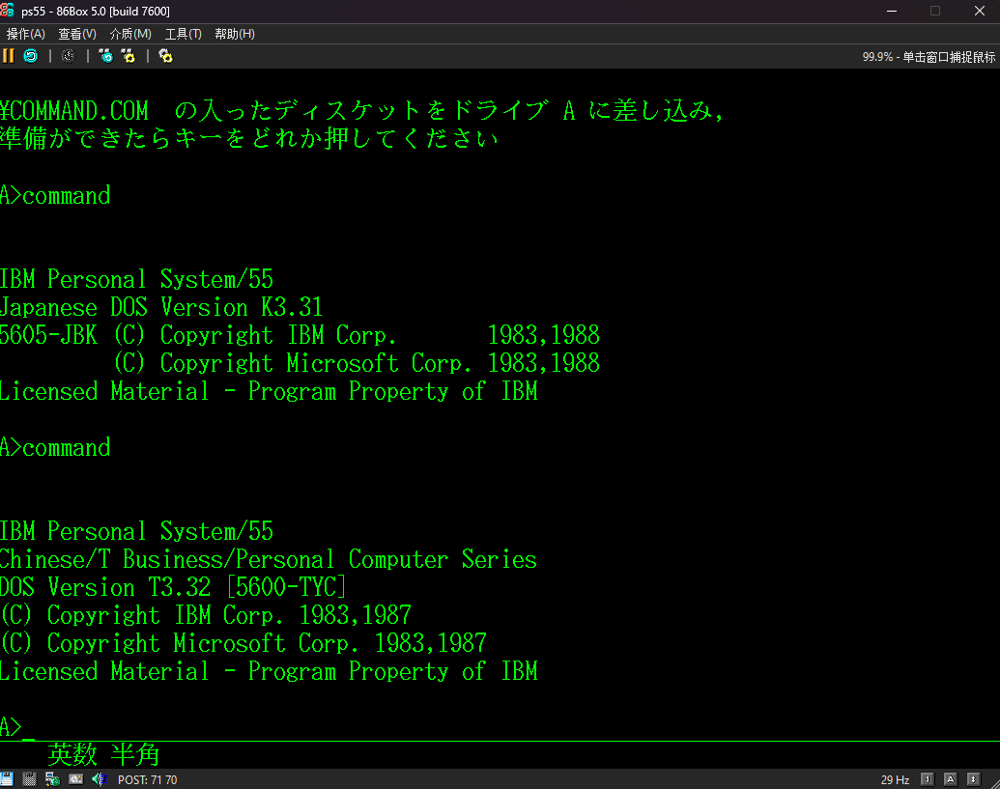
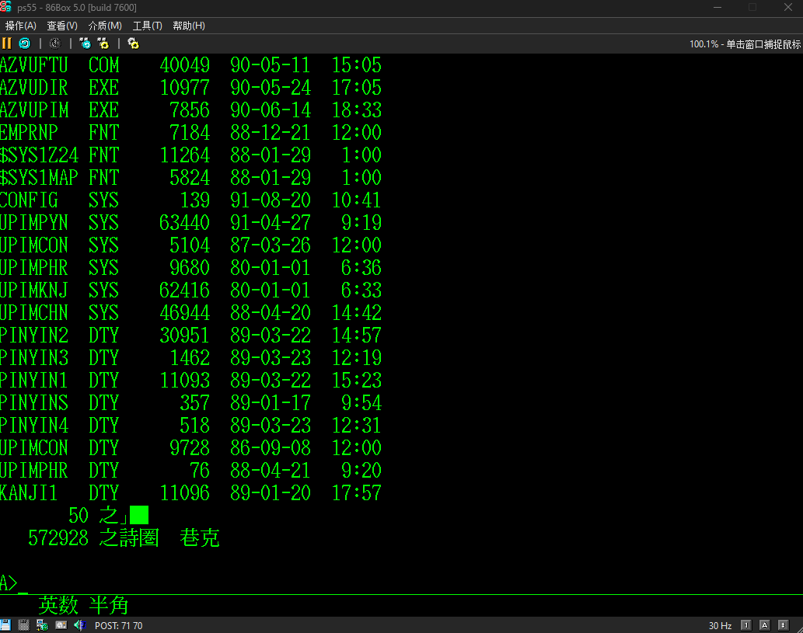
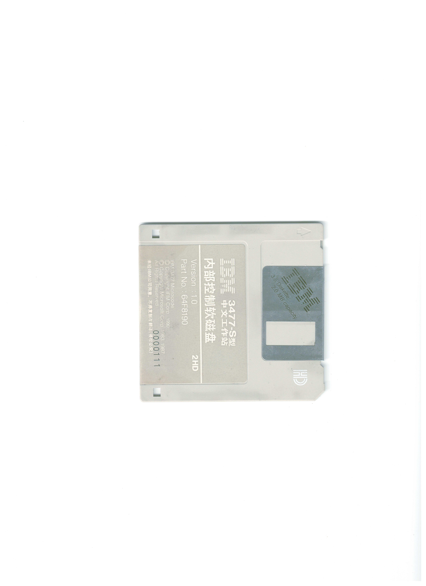
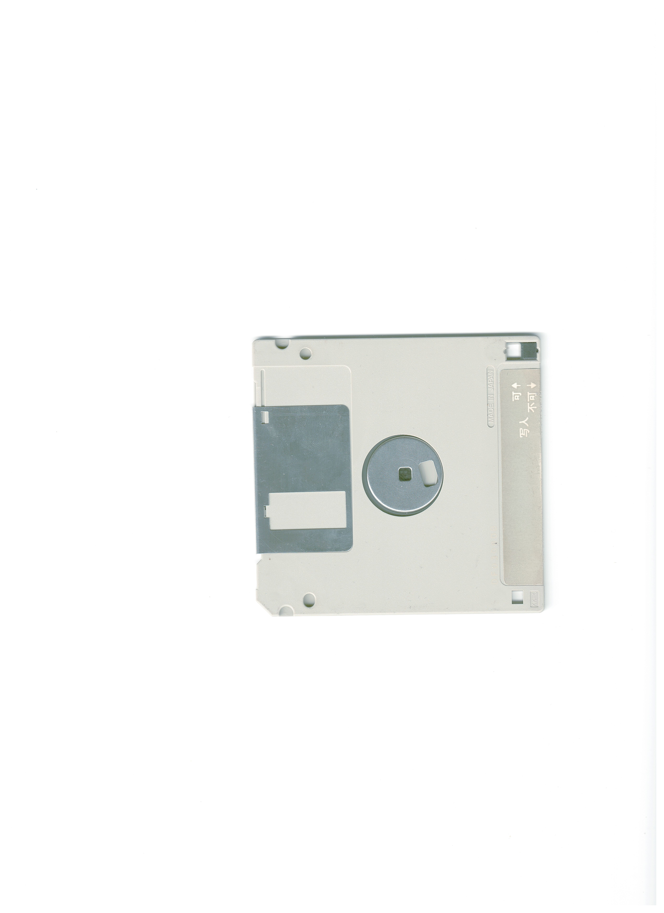
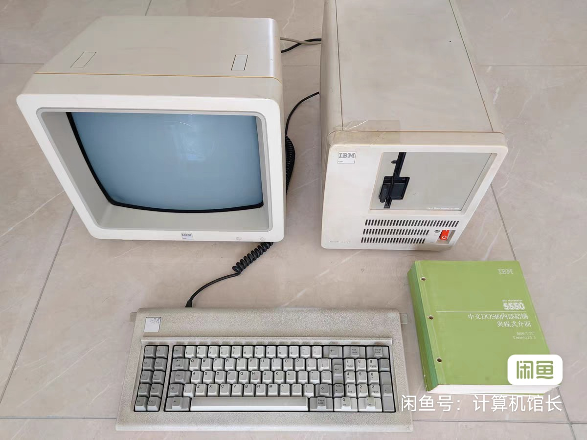

<head>
 
</head>

  
 <h1>IBM PC DOS T3.32</h1>
 
MultiWiki

 <table>
  <tr>
   <td>软件序号</td>
   <td>5600-TYC</td>
  </tr>
  <tr>
   <td>发布时间</td>
   <td>1987</td>
  </tr>
  <tr>
   <td>完整度</td>
   <td>仅COMMAND.COM</td>
  </tr>
  <tr>
   <td>媒体</td>
   <td>软盘</td>
  </tr>
 </table>

 

  <h1>简介</h1>
  

  IBM PC DOS T3.32的COMMAND.COM是从简体中文IBM 3477-S启动盘导出的。3477-S不同于普通Multistation，引导扇区及IBMBIO均不一样，几乎无法将其完整移植到普通Multistation或PS/55，又因为简体中文Multistation及繁体中文PS/55字体均和本版本COMMAND.COM不兼容，所以目前只能显示乱码。 
  奇怪的是，3477-S启动盘是简体中文，但内部包含的却是T版本DOS——繁体中文版本DOS。 
   IBM DOS T3.3 的说明书在几年前在闲鱼有安装软盘和机器本体一同售卖。 
  

 

  <h1>截图与照片</h1>
  

   <table>
   <td>
     
COMMAND.COM

    </td>
    <td>
     
Dir

    </td>
    <td>
     
软盘 1

    </td>
    <td>
     
软盘 2

    </td>
    <td>
     
说明书

    </td>
   </table>
  

 

 

  <h1>镜像下载</h1>
  

   <a href="./64F8190_GW.7z" target="_blank" >64F8190_GW</a>
  

 

  <h1>参考</h1>
  

   <a href="https://www.goofish.com/item?id=654860755022" target="_blank" >闲鱼链接</a> 
   <a href="https://www.351workshop.top/pages/hardlib/ibm-3477-s/" target="_blank" >IBM 3477-S 中文工作站</a>
  

 

