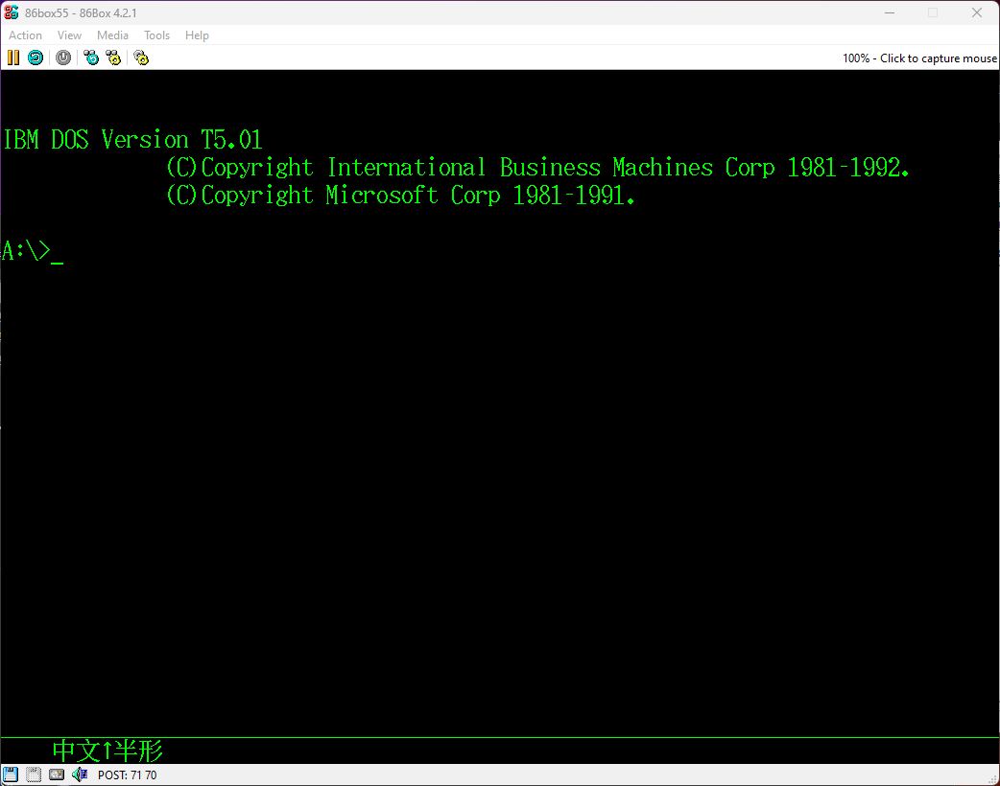

<head>
 
</head>

  
 <h1>IBM PC DOS T5.01</h1>
 
MultiWiki

 <table>
  <tr>
   <td>软件序号</td>
   <td>/</td>
  </tr>
  <tr>
   <td>发布时间</td>
   <td>1992</td>
  </tr>
  <tr>
   <td>完整度</td>
   <td>完整</td>
  </tr>
  <tr>
   <td>媒体</td>
   <td>硬盘镜像</td>
  </tr>
 </table>

 

  <h1>简介</h1>
  

  IBM PC DOS T5.01在我的PS/55 5541中提取，包含完整硬盘镜像。
  

 

  <h1>截图与照片</h1>
  

   <table>
   <td>
     
COMMAND.COM

    </td>
   </table>
  

 

  <h1>镜像下载</h1>
  

   <a href="https://archive.org/details/ibm-5541-harddisk-raw" target="_blank" >IBM 5541 Harddisk RAW [Archive.org]</a>
  

  <h1>参考</h1>
  

   <a href="https://www.351workshop.top/pages/hardlib/ibm-ps55-5541-tc4/" target="_blank" >IBM PS/55 5541-TC4</a>
  

